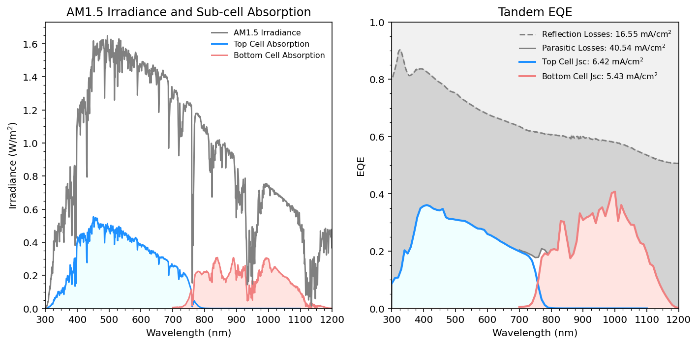

# External Quantum Efficiency
Control software and analysis code for conducting EQE measurements in the FRG.
Analysis requres EQE of top and bottom cells, and tandem reflectance measurement.

### Demo Tandem Analysis

